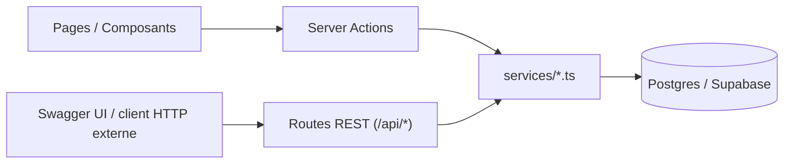

# Conception — API REST documentée + Swagger par feature

> Spec de conception (2026-09-22). À valider avant passage à un plan d'implémentation (skill `writing-plans`).

## 1. Objectif

Rendre chaque feature de Cantor **isolée, documentée et testable via HTTP**, à des fins de maintenance interne — pas une API publique pour des tiers. Concrètement :

1. Chaque feature a une doc dédiée (`doc/features/*.md`) : objectif, modèle de données, endpoints, règles métier, fichiers clés.
2. Chaque feature est joignable en **REST HTTP**, pas seulement via Server Actions Next.js (qui ne sont pas appelables depuis un outil externe type Postman/Swagger).
3. Une **spec OpenAPI 3.0** décrit l'ensemble des endpoints, servie par une page **Swagger UI** interne (`/api-docs`) pour naviguer/tester.

## 2. Principe d'architecture : additif, pas de remplacement

Les Server Actions existantes (`src/actions/*.ts`) restent en place et continuent d'alimenter l'UI — **aucune régression, aucun changement de comportement visible**. Les nouvelles routes REST appellent les **mêmes fonctions `services/*.ts`** que les Server Actions : pas de logique dupliquée, juste un second point d'entrée HTTP là où il n'en existe pas encore.



**Authentification** : les routes REST réutilisent le cookie de session Supabase déjà en place (`getAuthContextForApi` / vérification `role === "chef"` selon l'action) — identique aux routes existantes. Pas de clé API séparée : usage interne uniquement, testé depuis le même navigateur connecté à l'app. La spec OpenAPI documente ce schéma comme `cookieAuth`.

**Hors scope explicite** : requêter la base de données brute (hors règles métier de l'app) est déjà couvert par l'API PostgREST auto-générée de Supabase (`https://tyvdubxilegrhqkrgtdm.supabase.co/rest/v1/`, spec OpenAPI native) — mentionné dans la doc plutôt que dupliqué.

## 3. Inventaire par feature

### 3.1 Chants (bibliothèque)
*Fichiers clés : `services/songs.ts`, `actions/songs.ts`, `api/chants/*`*

| Méthode | Route | État | Détail |
|---|---|---|---|
| GET | `/api/chants` | Existant | Liste des chants de la chorale. **Ajout** : paramètres `?q=&type=&diff=&status=&validation_status=` (déjà supportés par `listSongsFiltered`, pas branchés en REST) |
| POST | `/api/chants` | À enrichir | Actuellement ne crée que la ligne `songs` — à aligner sur `createSongAction` : accepter aussi `lyrics[]`, `youtube_links[]`, `voice_guides[]` dans le même payload |
| GET | `/api/chants/{id}` | Existant | Chant + paroles + liens YouTube + guides voix |
| PATCH | `/api/chants/{id}` | Existant | Déjà complet (chant + sous-ressources) |
| DELETE | `/api/chants/{id}` | Existant | — |

### 3.2 Validation du répertoire
*Fichiers clés : `services/validation.ts`, `actions/validation.ts` — **aucune route REST actuellement***

| Méthode | Route | Détail |
|---|---|---|
| POST | `/api/chants/{id}/submit` | Choriste → soumet le chant (`brouillon` → `en_attente`) |
| POST | `/api/chants/{id}/validate` | Chef uniquement → valide (`en_attente` → `validé`) |
| POST | `/api/chants/{id}/reject` | Chef uniquement, body `{ note: string }` → rejette avec motif |
| POST | `/api/chants/{id}/reset-to-draft` | Repasse en `brouillon` après rejet |

### 3.3 Notifications
*Fichiers clés : `services/notifications.ts`, `actions/notifications.ts` — **aucune route REST actuellement***

| Méthode | Route | Détail |
|---|---|---|
| GET | `/api/notifications` | Liste (10 dernières) + `unreadCount` pour l'utilisateur connecté |
| PATCH | `/api/notifications/{id}` | Body `{ read: true }` → marque une notification lue |
| POST | `/api/notifications/mark-all-read` | Marque tout comme lu |

### 3.4 Répétitions
*Fichiers clés : `services/repetitions.ts`, `actions/repetitions.ts`, `api/repetitions/*`*

| Méthode | Route | État |
|---|---|---|
| GET | `/api/repetitions` | Existant |
| POST | `/api/repetitions` | Existant |
| GET | `/api/repetitions/{id}` | **Nouveau** — répétition + chants programmés |
| PATCH | `/api/repetitions/{id}` | **Nouveau** — aligné sur `updateRehearsalAction` |
| DELETE | `/api/repetitions/{id}` | **Nouveau** |

### 3.5 Feuilles de messe
*Fichiers clés : `services/messe.ts`, `actions/messe.ts`, `api/messe/*`*

| Méthode | Route | État |
|---|---|---|
| GET | `/api/messe` | Existant |
| POST | `/api/messe` | Existant |
| GET | `/api/messe/{id}` | **Nouveau** |
| PATCH | `/api/messe/{id}` | **Nouveau** — aligné sur `updateMasseAction` |
| DELETE | `/api/messe/{id}` | **Nouveau** |

### 3.6 Chorale / paramètres
*Fichiers clés : `services/choirs.ts`, `api/choir/*` — déjà complet*

| Méthode | Route | État |
|---|---|---|
| GET | `/api/choir` | Existant — infos chorale + rôle + membres |
| PATCH | `/api/choir` | Existant — update infos / régénération code invitation (chef) |

*(Gestion fine des membres — retrait, changement de rôle — actuellement seulement via `services/choirs.ts` appelé côté page ; à documenter comme non exposé en REST pour l'instant, sauf si besoin confirmé.)*

### 3.7 YouTube & Transcription — déjà complets, juste à documenter
`GET /api/youtube`, `POST /api/transcribe` (docx/pdf/image → texte structuré).

## 4. Spec OpenAPI

- Fichier `src/openapi/spec.json` (OpenAPI 3.0), importé directement par la page Swagger (`import spec from "@/openapi/spec.json"` — supporté nativement par Next.js, pas besoin de loader YAML).
- Un schéma de composant par entité (`Song`, `Rehearsal`, `MassSheet`, `Notification`, `Choir`…), réutilisés entre endpoints.
- `securitySchemes.cookieAuth` documenté globalement ; chaque endpoint chef-only annoté (description explicite, pas de mécanisme de scope OpenAPI dédié — YAGNI pour un usage interne).
- Réponses d'erreur standardisées : `401` (non connecté), `403` (rôle insuffisant), `404`, `500`, avec un schéma `Error { error: string }` commun (déjà le format réel de toutes les routes actuelles).

## 5. Swagger UI

- Page `src/app/api-docs/page.tsx` (hors du groupe `(app)`, plein écran — Swagger UI n'a pas besoin de la Sidebar/TopBar).
- Protégée par la garde globale existante (`proxy.ts`) : `/api-docs` n'est pas dans la liste blanche → redirection `/login` si non connecté, comme le reste de l'app. Pas de restriction par rôle (documentation, pas d'action sensible).
- Librairie `swagger-ui-react` (nouvelle dépendance), rendu client (`"use client"`), spec passée directement en prop.
- "Try it out" fonctionne tel quel : requêtes envoyées en `same-origin`, le cookie de session Supabase suit automatiquement.

## 6. Docs par feature (`doc/features/*.md`)

Un fichier par feature (`chants.md`, `validation.md`, `notifications.md`, `repetitions.md`, `messe.md`, `chorale.md`), même structure :

```
# Feature : <nom>
## Objectif — une phrase
## Modèle de données — tables Postgres concernées + colonnes clés
## Endpoints — tableau méthode/route/rôle requis/description (renvoie vers la spec OpenAPI)
## Règles métier — qui peut faire quoi, transitions d'état le cas échéant
## Fichiers clés — services/, actions/, api/, composants UI principaux
```

## 7. Plan de test

Pas de suite automatisée existante (limitation connue, §14 de `doc/ARCHITECTURE.md`) — vérification manuelle par endpoint via Swagger UI (connecté en chef puis en choriste, pour vérifier les 403 attendus), plus `npx tsc --noEmit` / `npx eslint` / `npm run build` comme pour les sprints précédents.

## 8. Découpage proposé pour l'implémentation

1. Infra OpenAPI + Swagger UI (page, dépendance, spec squelette) + documentation des routes **déjà existantes** (chants, messe, repetitions, choir, youtube, transcribe)
2. Nouvelles routes **validation** + doc feature
3. Nouvelles routes **notifications** + doc feature
4. Extension **POST /api/chants** (sous-ressources) + nouvelles routes **messe/{id}** et **repetitions/{id}** + docs features restantes

Chaque étape : code → `tsc`/`eslint` propres → mise à jour spec OpenAPI → commit séparé.
