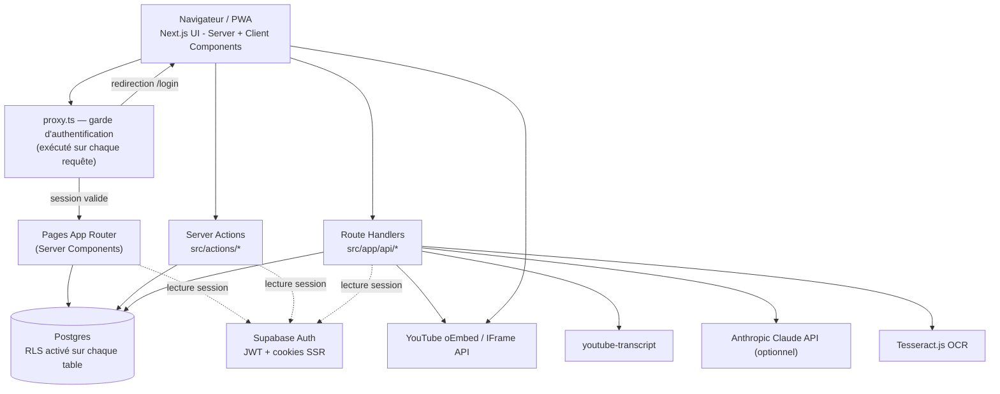
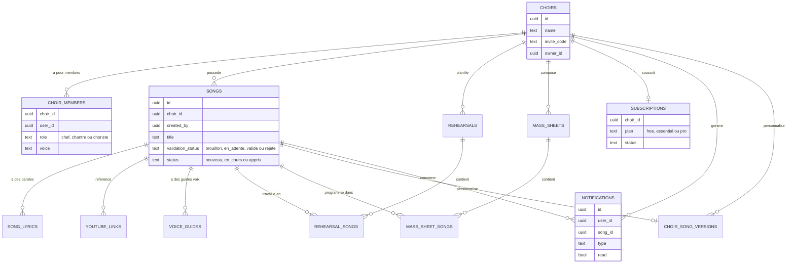
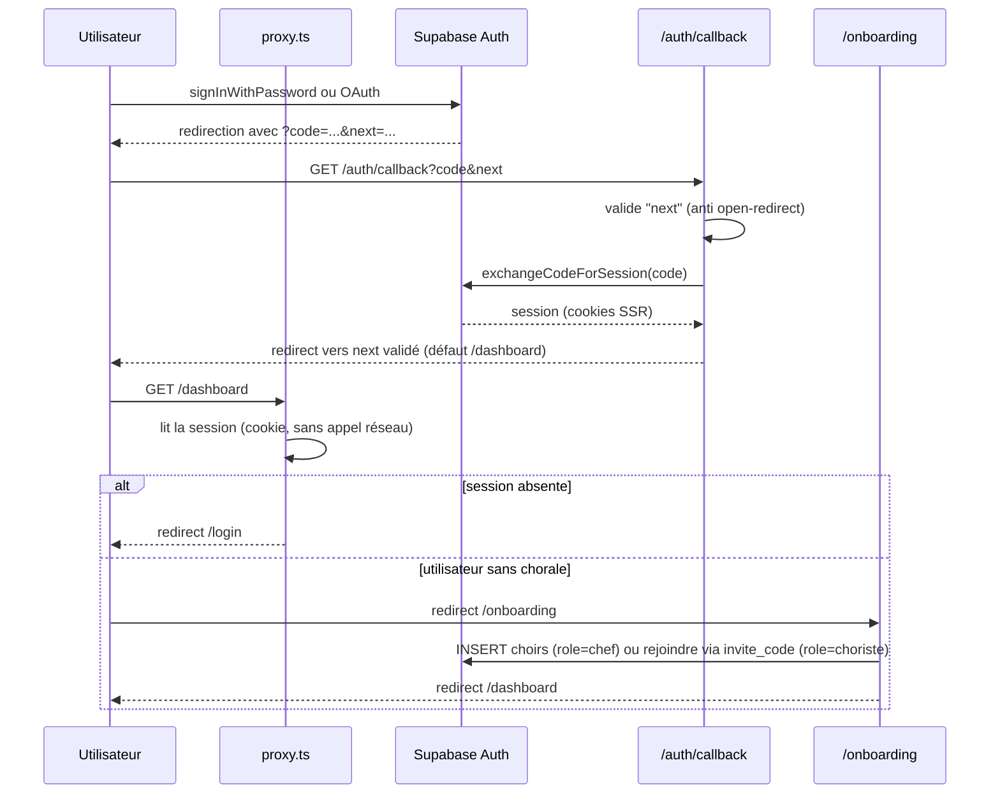
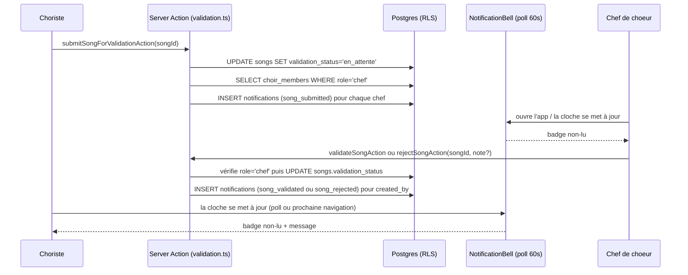

# Dossier d'architecture technique — Cantor

> Application PWA de gestion chorale pour le Chœur Céleste. Ce document décrit l'état réel du code au **2026-09-20** (commit `6cfc026`). Il fait l'inventaire des fonctionnalités et documente l'architecture technique : stack, structure, modèle de données, sécurité et flux principaux.

## Sommaire

1. [Vue d'ensemble](#1-vue-densemble)
2. [Stack technique](#2-stack-technique)
3. [Architecture système](#3-architecture-système)
4. [Structure du projet](#4-structure-du-projet)
5. [Modèle de données](#5-modèle-de-données)
6. [Sécurité](#6-sécurité)
7. [Flux d'authentification et d'onboarding](#7-flux-dauthentification-et-donboarding)
8. [Flux de validation des chants et notifications](#8-flux-de-validation-des-chants-et-notifications)
9. [Surface API interne](#9-surface-api-interne)
10. [PWA](#10-pwa)
11. [Intégrations externes](#11-intégrations-externes)
12. [Rôles et permissions](#12-rôles-et-permissions)
13. [Inventaire fonctionnel détaillé](#13-inventaire-fonctionnel-détaillé)
14. [Limitations connues et dette technique](#14-limitations-connues-et-dette-technique)
15. [Déploiement et configuration](#15-déploiement-et-configuration)

---

## 1. Vue d'ensemble

**Cantor** est une application web installable (PWA) destinée à la gestion du répertoire d'une chorale liturgique : bibliothèque de chants multilingue, feuilles de messe, suivi des répétitions, validation du répertoire par le chef de chœur, et outils d'apprentissage par pupitre (soprano/alto/ténor/basse).

Deux rôles cohabitent dans une même chorale :
- **Chef de chœur** — administre la chorale, valide ou rejette les chants proposés, gère les membres.
- **Choriste** — consulte le répertoire, propose des chants, s'exerce avec les guides voix, suit les répétitions.

Chaque chorale est un tenant isolé : toutes les données (chants, répétitions, feuilles de messe, notifications) sont scopées par `choir_id` et protégées par des règles RLS Postgres (section 6).

## 2. Stack technique

| Couche | Technologie |
|---|---|
| Framework | Next.js **16.2.6** (App Router, React 19, Turbopack) |
| Langage | TypeScript 5 |
| UI | Tailwind CSS v4, `lucide-react`, composants maison (pas de librairie UI tierce) |
| Backend applicatif | Server Components, Server Actions (`"use server"`), Route Handlers (`src/app/api/*`) |
| Auth & données | Supabase (Postgres + Supabase Auth), accès via `@supabase/ssr` / `@supabase/supabase-js` |
| Garde d'accès | `src/proxy.ts` — équivalent du middleware, renommé **Proxy** depuis Next.js 16 |
| Dates | `date-fns` (+ locale `fr`) |
| IA / texte | `@anthropic-ai/sdk` (Claude, optionnel), `tesseract.js` (OCR), `mammoth` (.docx), `pdf-parse` (.pdf) |
| Vidéo | YouTube oEmbed, YouTube IFrame API (client), `youtube-transcript` |
| PWA | `public/manifest.json` + `public/sw.js` (service worker minimal, voir §10 et §14) |

> ⚠️ **AGENTS.md du repo** signale explicitement que ce Next.js 16 a des conventions différentes des versions connues (ex. `middleware.ts` → `proxy.ts`). Vérifié dans `node_modules/next/dist/docs/` pour ce document.

## 3. Architecture système



**Principe** : aucune logique métier côté client n'accède directement à Supabase avec des droits élevés — tout passe soit par des Server Components/Actions (qui utilisent la session SSR de l'utilisateur, donc soumis à RLS comme lui), soit par des Route Handlers qui revérifient l'utilisateur (`getAuthContextForApi`). Il n'y a pas de clé `service_role` utilisée côté serveur : la sécurité repose sur les policies RLS + le contexte utilisateur, pas sur un bypass applicatif.

## 4. Structure du projet

```
cantor/
├── proxy.ts n'existe qu'en src/proxy.ts (garde d'auth globale)
├── src/
│   ├── app/
│   │   ├── page.tsx                  # Landing page publique
│   │   ├── login/, register/         # Auth (email/mdp + OAuth Supabase)
│   │   ├── onboarding/                # Créer / rejoindre une chorale
│   │   ├── auth/callback/route.ts    # Échange code OAuth → session
│   │   ├── (app)/                    # Groupe de routes protégées (layout partagé)
│   │   │   ├── layout.tsx            # Sidebar (desktop) + TopBar/BottomNav (mobile)
│   │   │   ├── dashboard/
│   │   │   ├── chants/               # Bibliothèque + fiche + validation
│   │   │   ├── messe/                # Feuilles de messe
│   │   │   ├── repetitions/          # Répétitions + maîtrise
│   │   │   └── parametres/           # Réglages chorale, membres, invite code
│   │   └── api/                      # Route Handlers REST (voir §9)
│   ├── actions/                      # Server Actions ("use server") — écriture
│   ├── services/                     # Accès Supabase réutilisable (lecture/écriture)
│   ├── components/
│   │   ├── layout/                   # Sidebar, TopBar, BottomNav, NotificationBell
│   │   └── player/                   # MiniPlayer, VoiceTools, AIPanel
│   ├── context/PlayerContext.tsx     # État global du lecteur audio/vidéo
│   ├── hooks/                        # useChoir, useSongs (fetch client-side via /api)
│   ├── lib/
│   │   ├── supabase/{client,server}.ts
│   │   └── auth.ts                   # getAuthContext / getAuthContextForApi
│   └── types/index.ts                # Types de domaine + constantes UI
├── supabase/
│   ├── schema.sql                    # Schéma de base (tables + RLS initiales)
│   └── migrations/
│       ├── 001_add_missing_fields.sql
│       ├── 002_song_validation.sql
│       └── 003_notifications.sql
└── public/                           # manifest.json, sw.js, assets, carnets de chant
```

**Convention de couches** : `actions/` (écriture, appelées depuis les Server/Client Components, valident l'utilisateur puis délèguent) → `services/` (requêtes Supabase pures, réutilisées par pages et actions) → Supabase. Les pages du groupe `(app)` sont des Server Components qui appellent directement les `services/*` en lecture ; les mutations passent par `actions/*`.

## 5. Modèle de données



### Détail des tables

| Table | Rôle | Colonnes notables |
|---|---|---|
| `choirs` | Une chorale (tenant) | `invite_code` (auto-généré), `owner_id` |
| `choir_members` | Appartenance + rôle | `role` (`chef`/`chantre`/`choriste`), `voice` (pupitre) |
| `songs` | Un chant du répertoire | `validation_status`, `status` (progression d'apprentissage), `structure` (JSONB couplets/refrain), `audio_*` par pupitre |
| `song_lyrics` | Paroles par langue | `language` (`fr`/`ki`/`sw`/`en`), `phonetic` |
| `youtube_links` | Versions vidéo d'un chant | `version_type`, `is_primary`, `detected_key`/`detected_bpm` (colonnes prévues pour analyse IA, non alimentées actuellement) |
| `voice_guides` | Note de départ par pupitre | `starting_note`, `entry_seconds`, `instructions` |
| `rehearsals` / `rehearsal_songs` | Répétitions et chants travaillés | `mastery` (0–100) |
| `mass_sheets` / `mass_sheet_songs` | Feuilles de messe et programme | `moment` (temps liturgique), `position` |
| `choir_song_versions` | Arrangement propre à une chorale | `custom_key`, `custom_tempo`, `is_official` |
| `subscriptions` | Plan d'abonnement (voir §14) | `plan`, `status`, `stripe_id` (non utilisé actuellement) |
| `notifications` *(migration 003)* | Notifications in-app | `type` (`song_submitted`/`song_validated`/`song_rejected`), `read` |

Toutes les tables ont `ENABLE ROW LEVEL SECURITY`, et pour les tables liées à un chant, l'accès est dérivé via `songs.choir_id IN (choir_members du user)`.

## 6. Sécurité

- **Isolation par chorale (RLS)** : chaque table métier restreint SELECT/INSERT/UPDATE/DELETE via une sous-requête sur `choir_members WHERE user_id = auth.uid()`. Un utilisateur ne peut jamais lire les données d'une chorale dont il n'est pas membre, même via l'API REST interne (les Route Handlers utilisent la session de l'utilisateur, pas une clé service).
- **Actions réservées au chef** : les Server Actions de validation (`validateSongAction`, `rejectSongAction`) et la route `PATCH /api/choir` revérifient explicitement `membership.role === "chef"` côté serveur, en plus des policies RLS.
- **Garde globale (`src/proxy.ts`)** : exécutée sur chaque requête (sauf assets statiques), elle lit la session via cookies SSR (`getSession()`, sans appel réseau) et redirige vers `/login` toute route non publique sans session. Liste blanche : `/`, `/login`, `/register`, `/onboarding`, `/auth/*`, `/api/*`, `/sw.js`, `/manifest.json`, `/favicon.svg`.
- **Vérification par requête** : `getAuthContext()` (pages, redirige si non connecté) et `getAuthContextForApi()` (API, renvoie 401) revalident systématiquement l'utilisateur — le proxy est une optimisation de redirection, pas la seule barrière (cf. recommandation officielle Next.js : *"Proxy should not be used as a full session management or authorization solution"*).
- **Correctifs de sécurité déjà appliqués** (historique de commits) :
  - Garde d'authentification manquante sur `/api/transcribe` — corrigée (`getAuthContextForApi` désormais appelé en début de `POST`).
  - *Open redirect* sur `/auth/callback` — le paramètre `next` est validé (`startsWith("/")`, rejette `//`, `/\` et la présence de `@`) avant d'être utilisé comme cible de redirection.

## 7. Flux d'authentification et d'onboarding



## 8. Flux de validation des chants et notifications

Ajouté en 2026-09 : un choriste propose un chant, le chef le valide ou le rejette, et chacun est notifié in-app (`src/services/notifications.ts`, `src/components/layout/NotificationBell.tsx`).



La table `notifications` autorise en INSERT tout membre de la même chorale que le destinataire (`choir_id IN (choir_members du auteur)`), mais restreint SELECT/UPDATE au seul destinataire (`user_id = auth.uid()`).

## 9. Surface API interne

### Route Handlers (`src/app/api/*`)

| Route | Méthodes | Rôle |
|---|---|---|
| `/api/chants`, `/api/chants/[id]` | GET/PATCH/DELETE… | CRUD chants côté client (utilisé par `useSongs`) |
| `/api/messe` | GET/POST | Feuilles de messe |
| `/api/repetitions` | GET/POST | Répétitions |
| `/api/choir` | GET/PATCH | Infos chorale, membres, régénération du code d'invitation (chef uniquement) |
| `/api/youtube` | GET | Résout une URL YouTube en métadonnées via oEmbed |
| `/api/transcribe` | POST | Transcription/OCR (voir §11) — fichier (docx/pdf/image), JSON (`youtube_url` ou `voice_transcript`) |

### Server Actions (`src/actions/*`)

| Fichier | Actions | Rôle |
|---|---|---|
| `songs.ts` | `createSongAction`, … | Création/édition de chants + paroles/YouTube/guides voix |
| `messe.ts` | CRUD feuilles de messe | |
| `repetitions.ts` | CRUD répétitions, maîtrise par chant | |
| `validation.ts` | `submitSongForValidationAction`, `validateSongAction`, `rejectSongAction`, `resetSongToDraftAction` | Workflow de validation (§8) |
| `notifications.ts` | `getMyNotificationsAction`, `markNotificationReadAction`, `markAllNotificationsReadAction` | Notifications in-app |
| `auth.ts` | `signOutAction` | Déconnexion |

Toutes les Server Actions revalident l'utilisateur (`supabase.auth.getUser()`) avant toute écriture — aucune ne fait confiance à un état client.

## 10. PWA

- `public/manifest.json` : nom, icônes (SVG), couleur de thème, `display: standalone`, raccourcis (`/chants`, `/repetitions`, `/messe`).
- `public/sw.js` : **service worker minimal qui se désinstalle lui-même** (`self.registration.unregister()`) — voir limitation en §14. L'app est installable (manifest valide) mais ne fonctionne pas hors-ligne.

## 11. Intégrations externes

| Service | Usage | Où |
|---|---|---|
| **Supabase Auth** | Email/mot de passe + OAuth, session via cookies SSR | `src/lib/supabase/*`, `src/proxy.ts` |
| **Supabase Postgres** | Toutes les données métier, RLS | `supabase/schema.sql` + migrations |
| **YouTube oEmbed** | Résoudre titre/chaîne/miniature d'une URL YouTube | `src/services/youtube.ts`, `/api/youtube` |
| **YouTube IFrame API** | Lecture vidéo intégrée (client) | `src/components/player/MiniPlayer.tsx` |
| **youtube-transcript** | Extraction de sous-titres pour formatage de paroles | `/api/transcribe` (branche `youtube_url`) |
| **Anthropic Claude API** (`@anthropic-ai/sdk`, optionnel via `ANTHROPIC_API_KEY`) | Formatage des paroles (couplets/refrain) + OCR Vision en fallback | `/api/transcribe` |
| **Tesseract.js** | OCR d'images (carnets de chant scannés) | `/api/transcribe` |
| **mammoth** / **pdf-parse** | Extraction de texte depuis `.docx` / `.pdf` | `/api/transcribe` |
| **Web Speech API** (navigateur, pas une lib) | Dictée vocale dans l'éditeur de paroles | `InlineLyricsEditor.tsx` |

## 12. Rôles et permissions

| Action | Choriste | Chantre | Chef |
|---|---|---|---|
| Consulter chants / répétitions / feuilles de messe de sa chorale | ✅ | ✅ | ✅ |
| Créer/éditer un chant (passe en `brouillon`) | ✅ | ✅ | ✅ |
| Soumettre un chant à validation | ✅ | ✅ | ✅ |
| Valider / rejeter un chant | ❌ | ❌ | ✅ |
| Supprimer un chant | auteur uniquement | ✅ | ✅ |
| Gérer les membres / rôles / code d'invitation | ❌ | ❌ | ✅ |
| Modifier les infos de la chorale | ❌ | ❌ | ✅ (`owner_id`) |

> Le rôle `chantre` existe dans le schéma (`choir_members.role`) et a des droits de suppression de chant équivalents au chef (policy RLS `songs_delete`), mais n'a pas de traitement différencié dans l'UI actuelle — à clarifier si un usage spécifique est prévu.

## 13. Inventaire fonctionnel détaillé

| Domaine | Fonctionnalité | État |
|---|---|---|
| **Auth & onboarding** | Connexion email/mot de passe + OAuth Supabase | ✅ Complet |
| | Callback OAuth sécurisé (anti open-redirect) | ✅ Complet |
| | Création d'une chorale (devient chef) | ✅ Complet |
| | Rejoindre une chorale via code d'invitation (devient choriste) | ✅ Complet |
| **Bibliothèque de chants** | CRUD chant (titre, tonalité, tempo, difficulté, type/temps liturgique, structure) | ✅ Complet |
| | Recherche + filtres (type, difficulté, statut) | ✅ Complet |
| | Paroles multilingues (fr/ki/sw/en) + phonétique | ✅ Complet |
| | Éditeur de paroles inline sur la fiche chant | ✅ Complet |
| | Import paroles depuis fichier (.docx, .pdf, image OCR) | ✅ Complet (backend + UI branchés) |
| | Dictée vocale (Web Speech API) | ✅ Complet — passe par l'API native du navigateur, pas par `/api/transcribe` |
| | Guides voix par pupitre (note de départ, entrée, instructions) | ✅ Complet |
| | Liens YouTube multiples par chant (choral/karaoké/pupitre/instrumental) | ✅ Complet |
| | Détection automatique langue/type liturgique à l'import | ✅ Complet (heuristique par mots-clés, affinée par Claude si `ANTHROPIC_API_KEY` défini) |
| | Panneau "Analyse IA" (tonalité, BPM, difficulté, type) | ✅ Affichage ; boutons **Transposer / Analyser non câblés** (UI seule, pas de `onClick`) |
| **Validation du répertoire** | Cycle brouillon → en attente → validé/rejeté (avec note de rejet) | ✅ Complet |
| | Page dédiée de validation (chef) | ✅ Complet |
| | Renvoi en brouillon après rejet pour correction | ✅ Complet |
| | **Notifications in-app** (soumission → chef, décision → auteur) | ✅ Complet (ajouté 2026-09-20, migration `003_notifications.sql`) |
| **Répétitions** | Planification (date, notes) | ✅ Complet |
| | Association de chants à une répétition + suivi de maîtrise (0–100 %, bouton cyclique) | ✅ Complet |
| **Feuilles de messe** | Composition (chants + moment liturgique + position) | ✅ Complet |
| | Impression (mise en page dédiée `@media print`, en-tête chorale, paroles incluses) | ✅ Complet (`window.print()`, pas de génération PDF serveur) |
| **Dashboard** | Vue d'ensemble (chants/répétitions/feuilles récents, totaux réels) | ✅ Complet |
| **Lecteur audio/vidéo** | Lecture YouTube intégrée, multi-vitesse (0.5×–1.25×), sélection de pupitre | ✅ Complet |
| | Mini-lecteur persistant (`MiniPlayer`) | ✅ Complet |
| **Paramètres** | Nom / ville / logo / description de la chorale | ✅ Complet |
| | Code d'invitation (affichage, copie, régénération) | ✅ Complet |
| | Liste des membres (rôle, pupitre) | ✅ Complet |
| **Abonnements** | Modèle de plans (`free`/`essential`/`pro`) + `isFeatureAllowed`/`getSongLimit` | ⚠️ **Scaffolding uniquement** : aucun flux de paiement (Stripe) ni page d'upgrade, `stripe_id` jamais renseigné |
| **PWA** | Manifest installable, icône, raccourcis | ✅ Complet |
| | Fonctionnement hors-ligne / cache | ❌ Non implémenté (service worker no-op, voir §14) |
| **Sécurité** | RLS multi-tenant sur toutes les tables | ✅ Complet |
| | Garde d'auth globale (`proxy.ts`) + revalidation par requête | ✅ Complet |

## 14. Limitations connues et dette technique

> Sprint « petits correctifs » (2026-09-20) : renommage de `NEXTAUTH_URL`, suppression du code orphelin de `/api/transcribe` et correction du lint historique — voir l'entrée correspondante ci-dessous, conservée à titre d'historique.

- **Aucune suite de tests automatisés** (pas de `jest`/`vitest`/`playwright` dans `package.json`) — toute vérification est manuelle actuellement.
- **`next build` échoue actuellement** : `/login` appelle `useSearchParams()` sans le envelopper dans une limite `<Suspense>`, ce qui fait échouer le prerendering (*"should be wrapped in a suspense boundary"*). Découvert en 2026-09-20 en vérifiant le sprint ci-dessus — `npx tsc --noEmit` et `next dev` ne détectent pas ce problème, seul `next build` le révèle. Pré-existant, sans lien avec les correctifs de ce sprint (fichier non modifié depuis le Sprint 4). **Bloquant pour tout déploiement de production tant que non corrigé.**
- **Service worker no-op** : `public/sw.js` se désinstalle immédiatement après activation. L'app est installable comme PWA mais n'offre aucune fonctionnalité hors-ligne malgré le nom "PWA".
- **Abonnements non finalisés** : le modèle de données et la logique de feature-gating (`getPlan`, `isFeatureAllowed`, `getSongLimit`) existent, mais rien ne crée ni ne met à jour de ligne `subscriptions` (pas d'intégration Stripe malgré la colonne `stripe_id`).
- **Panneau IA partiellement statique** : les boutons "Transposer" et "Analyser" dans `AIPanel.tsx` n'ont pas de gestionnaire d'événement — actions non implémentées.
- **Pas de Supabase Storage détecté** : `score_url`/`audio_url`/`logo_url` sont de simples champs texte — aucun flux d'upload de fichier vers un bucket n'a été trouvé dans le code ; ces URLs doivent être renseignées manuellement (ou par un flux externe non présent dans ce repo).
- ~~Code orphelin dans `/api/transcribe`~~ — **corrigé** (2026-09-20) : les branches JSON `youtube_url`/`voice_transcript` et la dépendance `youtube-transcript` (jamais appelées par l'UI) ont été supprimées.
- ~~Lint non propre~~ (`useChoir.ts`, `useSongs.ts`, `services/choirs.ts`, `MiniPlayer.tsx`) — **corrigé** (2026-09-20) : `any` remplacés par des types explicites (dont une déclaration locale minimale pour l'API YouTube IFrame dans `MiniPlayer.tsx`) ; le `setState` synchrone dans un effet a été résolu en inlinant le chargement initial dans l'effet (continuation après `await`) et en gardant `refetch()` séparé pour le rechargement manuel. `npm run lint` et `npx tsc --noEmit` sont propres sur ces 4 fichiers.
- ~~Variable d'environnement `NEXTAUTH_URL`~~ — **corrigé** (2026-09-20) : renommée `NEXT_PUBLIC_APP_URL` dans `.env.local`/`.env.example` (confirmé non lue par le code, donc sans risque de régression).

## 15. Déploiement et configuration

**Variables d'environnement** (`.env.local`, voir `.env.example`) :

| Variable | Usage |
|---|---|
| `NEXT_PUBLIC_SUPABASE_URL` / `NEXT_PUBLIC_SUPABASE_ANON_KEY` | Connexion Supabase (client + serveur) |
| `YOUTUBE_API_KEY` | Réservé pour YouTube Data API v3 (non observé utilisé directement dans le code actuel — l'oEmbed ne nécessite pas de clé) |
| `ANTHROPIC_API_KEY` | Optionnel — active le formatage/OCR via Claude dans `/api/transcribe` |
| `NEXT_PUBLIC_APP_URL` | URL de base de l'app (renommée depuis `NEXTAUTH_URL`, voir §14) |

**Migrations base de données** : appliquées manuellement via l'éditeur SQL du dashboard Supabase (pas de `supabase/config.toml` ni de CLI liée dans ce repo) :
1. `supabase/schema.sql` — schéma initial + RLS
2. `001_add_missing_fields.sql`
3. `002_song_validation.sql`
4. `003_notifications.sql`

**Cible de déploiement** : application Next.js standard (compatible Vercel), aucune configuration spécifique de déploiement trouvée dans le repo au-delà de `next.config.ts` (images distantes Unsplash).
